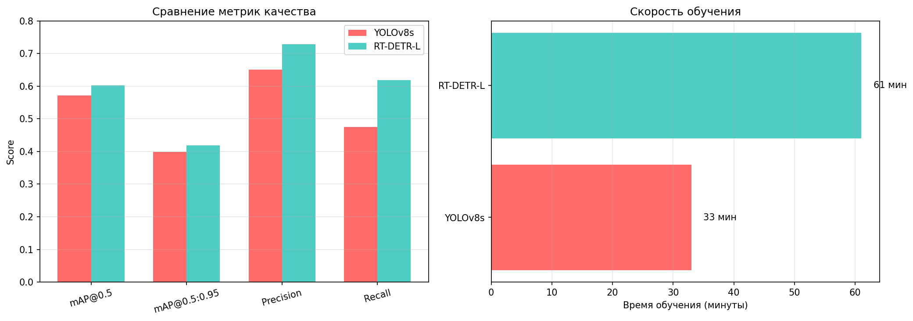
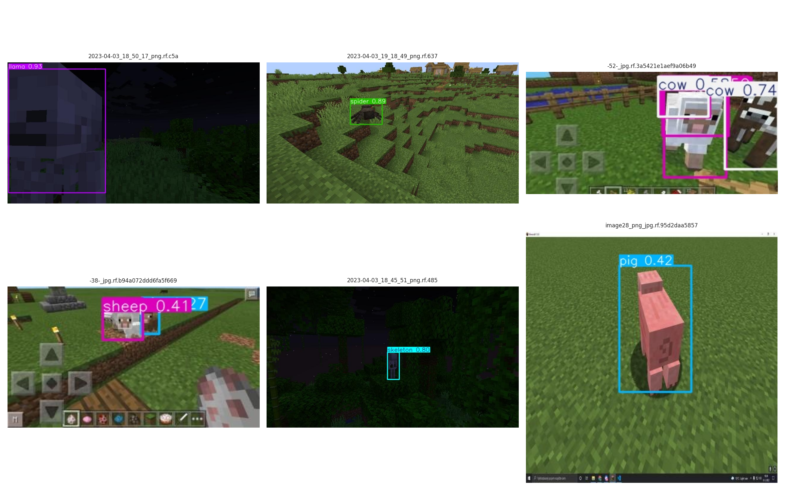
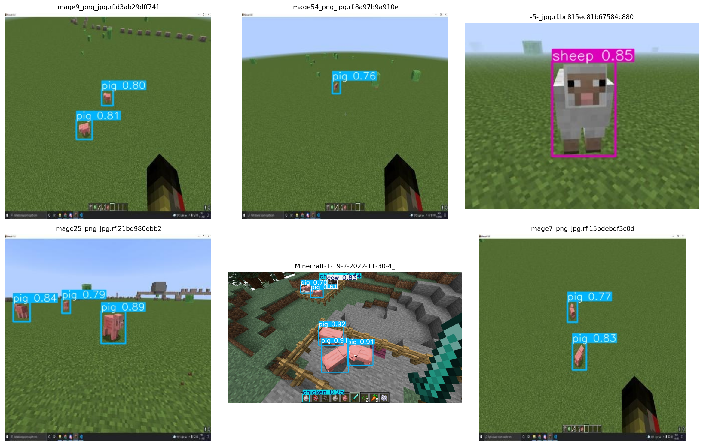
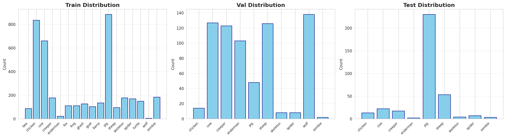

# Minecraft Object Detection

Проект по детекции персонажей Minecraft с использованием современных архитектур компьютерного зрения.

## Результаты

| Модель | mAP@0.5 | mAP@0.5:0.95 | Precision | Recall | Время обучения |
|--------|---------|--------------|-----------|--------|----------------|
| YOLOv8s | 0.571 | 0.399 | 0.650 | 0.475 | 33 мин |
| RT-DETR-L | 0.602 | 0.418 | 0.729 | 0.618 | 61 мин |



## Задача

Детекция 17 типов персонажей (мобов) из игры Minecraft:
- Дружелюбные: bee, chicken, cow, fox, frog, goat, llama, pig, sheep, turtle, wolf
- Нейтральные: enderman
- Враждебные: creeper, ghast, skeleton, spider, zombie

## Структура датасета
```
datasets/minecraft/
├── train/          # 1,349 изображений
├── val/            # 192 изображения
└── test/           # 422 изображения
```

Формат: COCO JSON преобразован в YOLO format

## Технологии

- Framework: Ultralytics (YOLOv8, RT-DETR)
- Backend: PyTorch 2.8.0, CUDA
- Platform: Google Colab (Tesla T4)

## Обучение

### YOLOv8s
- Эпох: 35 (EarlyStopping на 10)
- Время: 33 минуты
- Параметры: ~11M

### RT-DETR-L
- Эпох: 20
- Время: 61 минута
- Параметры: ~32M

## Метрики обучения

### YOLOv8s


### RT-DETR-L


## Примеры детекции

### YOLOv8s


### RT-DETR-L


## Анализ данных

### Распределение классов


Наблюдения:
- Наиболее представленные: cow (215), creeper (206), enderman (172)
- Наименее представленные: zombie (3), skeleton (15), bee (24)
- Дисбаланс классов влияет на качество детекции редких мобов

## Выводы

### RT-DETR vs YOLOv8s

Преимущества RT-DETR:
- Лучшее качество: +5.4% mAP@0.5, +4.8% mAP@0.5:0.95
- Значительно выше Recall: +30% (0.618 vs 0.475)
- Лучше детектирует редкие классы благодаря transformer-архитектуре

Преимущества YOLOv8s:
- Быстрее обучается: в 1.8 раза (33 vs 61 мин)
- Меньше параметров: ~11M vs ~32M
- Хорошая точность (Precision: 0.650)

Рекомендации:
- RT-DETR: для задач, где важно качество и полнота детекции
- YOLOv8s: для быстрого прототипирования и real-time приложений

## Структура проекта
```
minecraft_detection_project/
├── notebooks/
│   └── minecraft_detection.ipynb
├── artifacts/
│   ├── metrics/
│   ├── inference/
│   ├── yolo_results.csv
│   └── rtdetr_results.csv
├── configs/
│   └── data_yolo.yaml
├── README.md
└── .gitignore
```

## Ссылки

- [Ultralytics YOLO](https://github.com/ultralytics/ultralytics)
- [RT-DETR Paper](https://arxiv.org/abs/2304.08069)
- [Minecraft Wiki](https://minecraft.fandom.com/wiki/Mob)


